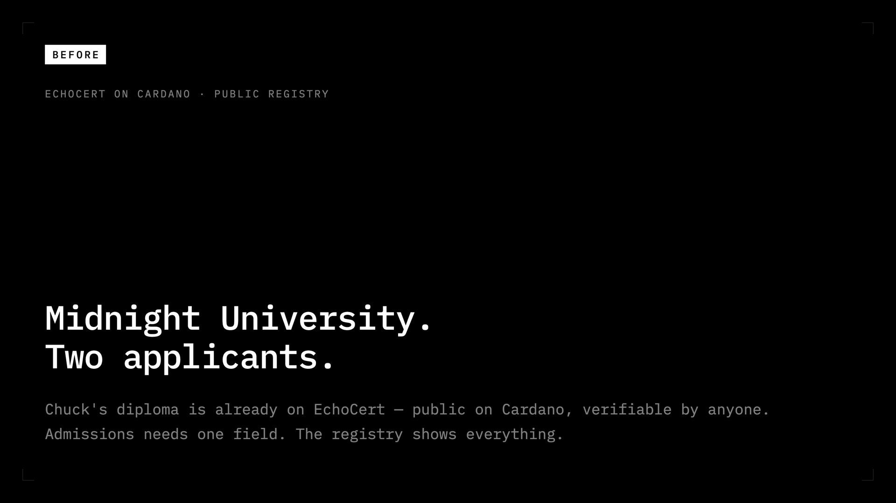
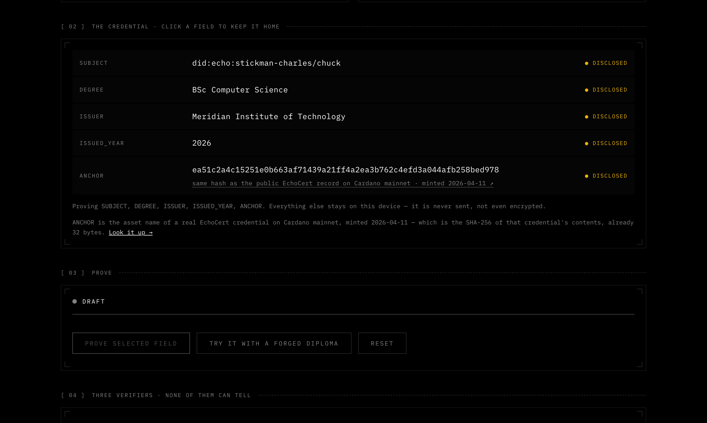
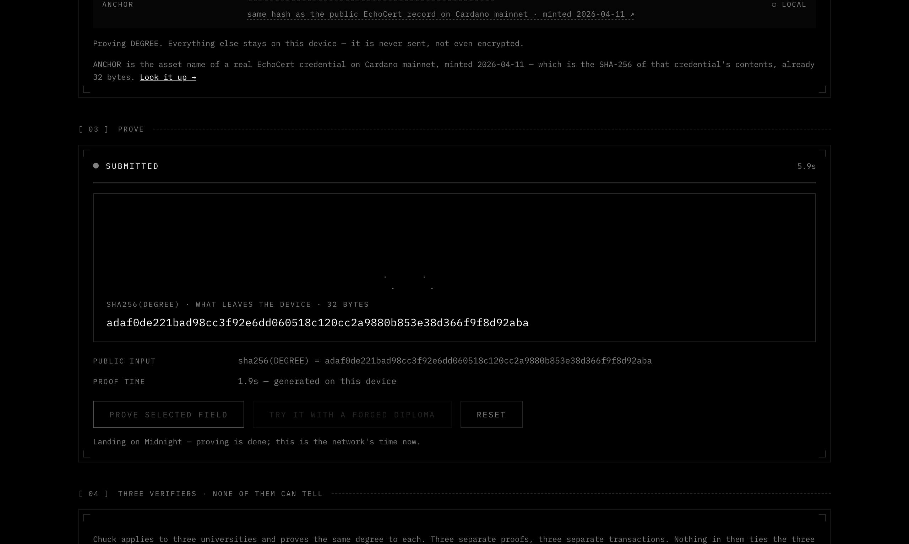
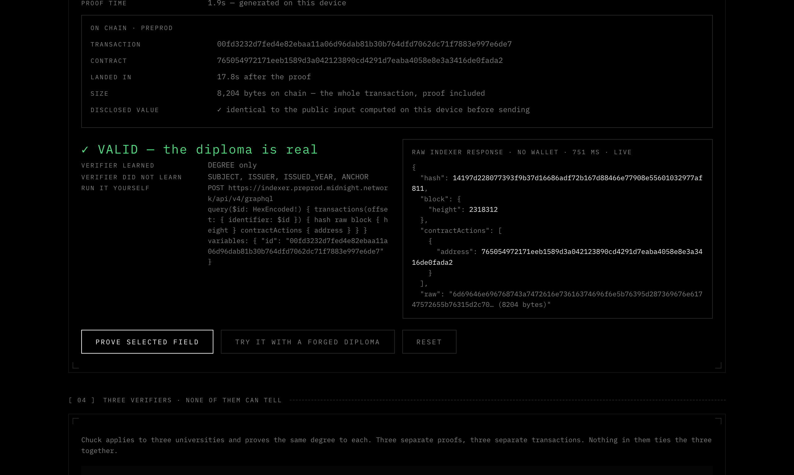
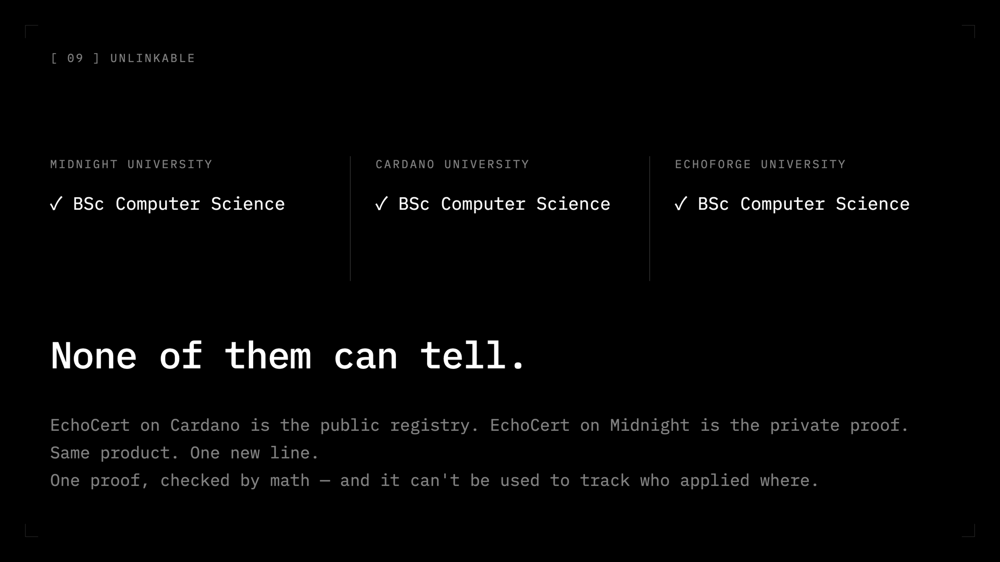

<p align="center">
  
</p>

<h1 align="center">EchoCert on Midnight</h1>

<p align="center"><strong>Prove one field of a diploma. Reveal nothing else.<br>Leave nothing behind that links two proofs to the same person.</strong></p>

<p align="center">
  
  
  
  
  
</p>

<p align="center">
  <a href="https://m.echoforgeef.com/echocert/">Live demo</a> ·
  <a href="⟨YouTube link⟩">Video (2:45)</a> ·
  <a href="PRIOR-WORK.md">Prior-work declaration</a> ·
  <a href="#the-story-the-demo-tells">The story</a> ·
  <a href="#try-it">Try it</a>
</p>

Built for the MLH Midnight Hackathon, 2026-08-28 → 08-30, by Charles Tao (solo),
in the **Integrate Midnight to Upgrade an Existing App** track. Built by
pair-programming with Claude Code. What existed before the event, and why this
moved quickly, is set out in [PRIOR-WORK.md](PRIOR-WORK.md).

**Live demo:** https://m.echoforgeef.com/echocert/ — proofs replayed from a real
run on public preprod, chain panel live. Run the repo locally and the same page
proves for real. **Video:** ⟨YouTube link⟩ — the captions are the narration; the
proving sequence is real time, landing on chain is the one sped-up shot and says so.

---

## The story the demo tells

Midnight University. Two applicants.

**Chuck** has a real diploma. It is already on EchoCert — my public credential
registry on Cardano — as a record anyone can verify. That is the BEFORE:
verifiable, and entirely public. Admissions needs one field; the registry shows
all five.

<p align="center"></p>

On Midnight the same credential stays on Chuck's device. The chain holds a
commitment to it, hashed once more before it is stored. The ANCHOR row is where
the two lines meet: its value is the SHA-256 that names the real Cardano record,
minted 2026-04-11, linked from the page so anyone can compare.

Chuck redacts four fields and proves one. His device generates a zero-knowledge
proof that a credential with this degree is in the registry — a Merkle path
against a root the contract knows — without revealing which entry. The only
thing that leaves the device is a hash of the degree: 32 bytes.

<p align="center"></p>

The transaction lands on public preprod. The university verifies it from the
transaction alone — a wallet-less query to the public indexer — and learns the
degree, and nothing else. Chuck is admitted.

<p align="center"></p>

**Charles** has no diploma, so he forges one. The Merkle path does not match his
credential, and the circuit refuses to produce a proof. It fails on his own
device in about twenty milliseconds. Nothing is sent.

Chuck also applied to two other universities. Three proofs, three transactions,
and nothing in them that two *different* holders' proofs would not also share —
measured, not assumed.

<p align="center"></p>

Chuck is my nickname. Both applicants are me: I built the public registry, and
then the private proof. The rest of that story is at the end of this file.

---

## The two lines

| | BEFORE — EchoCert on Cardano | AFTER — EchoCert on Midnight |
|---|---|---|
| What it is | A public credential registry, live today | The same credential, proved selectively |
| A verifier learns | Every field of the credential | Exactly the one field they asked for |
| Two proofs by one holder | Trivially linkable | Not linkable |
| Verifiable by anyone | Yes | Yes |

EchoCert already works. A university anchors a diploma, an employer verifies it,
and the maths holds up. The problem is what verification costs the holder: to
prove *"I have a BSc"* they publish their name, their institution, their year,
and the anchor that identifies the record forever.

The Midnight line keeps the verifiability and drops the rest.

---

## What actually happens

A credential has five fields. It lives in the holder's own private state — the
ledger only ever sees a commitment, and the tree hashes even that before storing
it. To prove one field, the holder's device:

1. recomputes the commitment for the credential it holds,
2. fetches a Merkle path for that commitment,
3. proves in zero knowledge that the path is valid against a root the contract
   knows, that the path's leaf **is** this credential's commitment, and
4. discloses one field, chosen at compile time.

The verifier gets a field and a proof. Not a credential, not an identifier, not
a way to recognise this holder next time.

### Why HistoricMerkleTree and not MerkleTree

`checkRoot` on a plain `MerkleTree` only accepts the current root, so every new
credential issued would invalidate every path already in holders' hands.
`HistoricMerkleTree` accepts prior roots. There is a test that issues a second
credential and re-proves the first.

### The line that carries the security

```compact
assert(path.leaf == commitment, "path does not correspond to this credential");
```

`MerkleTreePath` carries its own leaf, and both the path and the credential come
from the same untrusted holder. Without this line a forger pairs someone's
genuine path with a credential they invented, the root check passes, and the
contract certifies a degree that was never issued. `contract/test/run.ts` runs
exactly that attack and asserts it fails.

---

## Try it

```bash
# 1. a proof server (Docker)
docker run -d --name midnight-proof-server -p 6300:6300 \
  midnightntwrk/proof-server:8.1.0 -- midnight-proof-server -v

# 2. compile the contract and run the local test matrix
cd contract
npm install
npm run build          # add :fast to skip ZK key generation while iterating
npm test               # 17 checks, no network needed

# 3. the full pipeline against a local devnet
npm run e2e            # real proofs, real transactions, real chain reads
npm run unlinkability  # tries to link two proofs by the same holder

# 4. the demo, with live proving
npm run prover         # deploys, issues, serves proofs on :8787
cd ../demo && python3 -m http.server 8080
```

Open `http://localhost:8080`. With the prover running the page says **LIVE** and
every proof is real. Without it the page says **REPLAY**, replays timings
measured from a real run, and says so — it never pretends to prove.

What you will see, in three moments:

- **PROVE.** The redacted fields dissolve into a field of glyphs and stay there
  until the prover reports that the proof exists — 1–4.5 s, different every
  time — then the field condenses into the only value that leaves the device:
  the SHA-256 of the chosen field, 32 bytes, computed on the page before
  anything is sent.
- **FINALIZE.** The transaction lands (~20 s) and the page fetches it back from
  the public indexer: hash, block, contract, and its real size in bytes. The
  disclosed value on chain is checked against the one computed locally.
- **VERIFY.** The verdict beside the raw indexer response — a wallet-less query
  with its real round trip, and the exact query you can paste to repeat it.

---

## Measured, not estimated

Local devnet, proof server 8.1.0, real PLONK proofs:

| Step | Time |
|---|---|
| `deployContract` | 19.5 s |
| `issue()` full pipeline | 17.3 s |
| `proveDegree()` full pipeline | 18.7 s |
| Proof generation alone | 1–4.5 s (varies run to run) |
| A forged credential being rejected | **21 ms, on the holder's own device** |
| Wallet-less indexer read | 7 ms |

Proving time genuinely varies by more than 2×, so the demo animates until the
prover reports that the proof exists, and never hard-codes a duration.

### And on public preprod

The same pipeline, against the public preprod network, 2026-08-28:

| Step | Time |
|---|---|
| `deployContract` | 22.5 s |
| `issue()` full pipeline | 22.7 s |
| `proveDegree()` full pipeline | 18.7 s |
| Proof transaction on chain | 8,205 bytes — the whole transaction, proof included |
| Wallet-less indexer read | 372 ms |

Contract `4719d2f6ebcddbda079ac07ec1cc7ea4019471ba254ca1846461c8e204d0769b` ·
issue tx `00f9dba9…ba10a51` · proveDegree tx `00eb3b27…d583ab`. Query the public
indexer yourself: `contractAction(address)` at
`https://indexer.preprod.midnight.network/api/v4/graphql`.

Getting there took a checkpoint-and-restore wallet sync
(`contract/e2e/sync-preprod.ts`) — a cold sync of the public chain no longer
fits in memory — and two kernel panics that turned out to be Docker Desktop's
VM, not the sync. The containers moved to OrbStack and the sync finished.

### Unlinkability, as an experiment rather than a claim

<details>
<summary>The experiment, step by step</summary>

"Two proofs by the same holder cannot be linked" is easy to assert. So
`contract/e2e/unlinkability.ts` tries to break it against a real chain, and
reports what it finds:

1. One holder proves the same field three times. What do the three transactions
   share? Six runs of 16 bytes or more — the longest 219 bytes.
2. A different holder proves against the same tree root. They share **219 bytes
   too** — exactly as much. A shared run is therefore evidence of a common
   contract, circuit and root, not of a common person.
3. The tree moves on and the first holder proves again. Two of the six runs
   vanish: those were the old Merkle root. Every run that *does* follow the
   holder also appears in a different holder's proof, so every one of them is a
   global constant.

The credential's commitment appears in none of the transactions at any point.

That third step is the one that matters. A value that followed the holder across
a root change, and was not shared with anyone else, would be a linking
identifier and the design would be broken. There is none.

```
NOTHING LINKS THE PROOFS
```

</details>

---

## One thing worth passing on

A circuit that only reads state computes a fee of zero on an idle chain. The
wallet then balances it with an empty `DustActions`, which the ledger rejects as
not-normalized — surfacing as `1010: Invalid Transaction: Custom error: 117`.
Circuits that write state are never affected, so the symptom is oddly specific:
deploy and issue land, the read-only proof does not.

```ts
DEFAULT_DUST_OPTIONS.additionalFeeOverhead = 1_000_000n;
```

That one line also turned out to be the whole story behind a failure I had
spent two days on before the event: on preprod, the identical proof transaction
died inside the wallet — `Wallet.Other: unreachable`, a WASM panic in
`dryRunFee` — eight times out of eight, while deploy and issue always landed.
Same asymmetry, different crash: the pre-GA devnet node rejects the zero-fee
transaction, the GA network's wallet path panics on it. With the overhead set,
it lands in 18.7 s.

---

## Repository

| Path | What |
|---|---|
| `contract/src/echocert.compact` | The contract |
| `contract/src/witnesses.ts` | Holder and issuer private state |
| `contract/test/run.ts` | 17 local checks including the forgery attack |
| `contract/e2e/devnet.ts` | Full pipeline against a local devnet |
| `contract/e2e/unlinkability.ts` | The experiment above — tries to link two proofs and fails |
| `contract/e2e/preprod.ts` | The same against public preprod |
| `contract/e2e/prover-service.ts` | The demo's LIVE prover |
| `demo/` | The demo page |
| `media/` | Screenshots and title cards used above |
| `PRIOR-WORK.md` | **What existed before the event, as the track requires — and how this moved as fast as it did** |

## Versions

Pinned to the support matrix as of 2026-08-28 — Compact toolchain 0.31.1
(language 0.23.0), compact-runtime 0.16.0, midnight-js 4.1.1, proof server
8.1.0. `@midnight-ntwrk/*` are pinned exactly, no `^`, because compiler and
runtime must match.

## Licence

Apache-2.0 for the code. The EchoForge and EchoCert names, marks and visual
identity are **all rights reserved** and not licensed — see [NOTICE](NOTICE).
Third-party audio: uisfx (MIT / CC0), Kenney UI pack (CC0).

## About the author

I'm Charles Tao. I'm 14 — born in 2012 — and I compete with my parents'
authorization, which MLH requires of entrants under 18. If the organisers need
anything further from a guardian, it is available on request.

The video ends on *"the forger is real — he built the system that caught him."*
That is not a metaphor. The Charles in the story has no diploma, and neither do
I; I'm years away from one. I built a public credential registry before I had a
credential to put in it, and then a way to prove one without showing it. Judge
the work by what the transactions show. The age is only why the story is told
the way it is.
