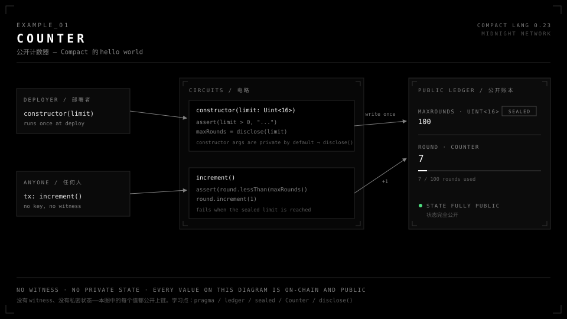
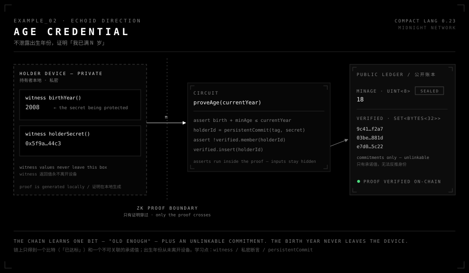
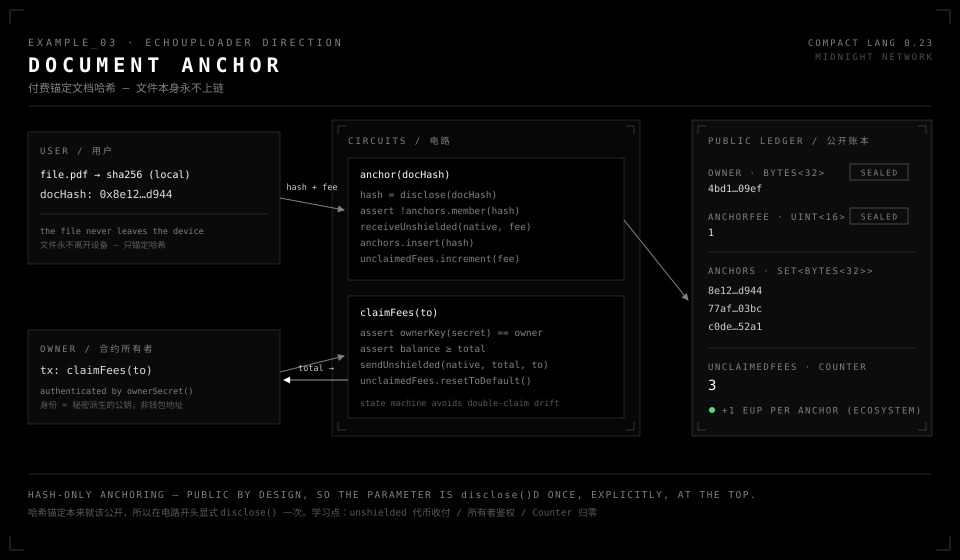
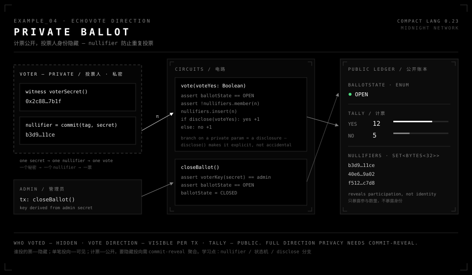

# Compact 示例合集

Midnight 智能合约语言 Compact 的四个参考示例，为未来 EchoForge 在 Midnight 上的开发做准备。
每个示例对应一个 Echo 产品方向，配一张讲解图（同名 `.svg`）。

> **版本事实（2026-08-05 写作时）**
> Compact toolchain 0.31.1 / language 0.23（即代码里的 `pragma language_version 0.23;`）。
> 编译器与 runtime 版本必须严格匹配，依赖固定版本号（不用 `^`/`~`）。
> 动手前先核对官方支持矩阵：<https://docs.midnight.network/relnotes/support-matrix>
> （版本冲突时以矩阵为准，矩阵比各组件 relnotes 更新。）

## 示例一览

| 示例 | 教什么 | Echo 方向 |
|---|---|---|
| [01-counter](01-counter.compact) | pragma / ledger / sealed / Counter / constructor | 入门 |
| [02-age-credential](02-age-credential.compact) | witness 私密数据、证明内断言、persistentCommit | EchoID |
| [03-document-anchor](03-document-anchor.compact) | unshielded 代币收付、所有者鉴权、显式 disclose | EchoUploader |
| [04-private-ballot](04-private-ballot.compact) | nullifier 防重投、enum 状态机、分支即披露 | EchoVote |

---

## 01 · Counter — 公开计数器



Compact 的 hello world：没有 witness、没有私密状态，图上每个值都公开上链。

要点：

- `sealed ledger` 只能在 constructor 里写一次，之后不可变。
- **constructor 参数默认是私密输入**——写入公开账本必须 `disclose(limit)`。这是 Compact 与普通语言最大的心智差异，从第一个示例就开始练。
- `Counter` 是账本 ADT：`increment` / `read` / `lessThan` / `resetToDefault`。

## 02 · Age Credential — 年龄凭证（EchoID 方向）



不泄露出生年份，证明「我已满 N 岁」。链上只得到一个比特（"已达标"）和一个不可关联的承诺值。

要点：

- `witness` 函数由持有者本地 DApp 提供，返回值永不明文离开设备。
- `assert(birth + minAge <= currentYear)` 在证明内运行——用加法而不是减法，没有下溢分支要考虑。
- `persistentCommit(tag, secret)` 以秘密作随机数的承诺**隐藏了输入**，所以插入账本不需要 `disclose()`；而 `persistentHash(witness 数据)` 是确定性的、可被暴力反推，公开它就需要 `disclose()`。这是两者的本质区别。
- `currentYear` 由调用者提供，生产环境必须锚定可信时间源。

## 03 · Document Anchor — 付费哈希锚定（EchoUploader 方向）



EchoUploader 的核心模式搬到 Midnight：文件本地做 SHA-256，链上只锚定哈希，锚定收一笔原生代币费用，所有者可提取累积费用。

要点：

- **circuit 参数默认私密**。锚定哈希本来就该公开，所以在电路开头 `disclose(docHash)` 一次、显式声明，而不是让披露散落各处。
- unshielded 代币三件套：`receiveUnshielded`（收费）、`unshieldedBalanceGte`（校验余额）、`sendUnshielded`（打款，收款方是 `Either<ContractAddress, UserAddress>`，用 `right<...>(addr)` 构造）。
- 所有者身份 = 秘密派生公钥 `persistentHash([pad(32, "tag"), secret])`，不是钱包地址。
- `unclaimedFees` 用 Counter 累计、提取后 `resetToDefault()`，避免"总量 × 单价"式核算在多次提取后漂移。

## 04 · Private Ballot — 匿名投票（EchoVote 方向）



计票公开、投票人身份隐藏。每个投票人的秘密派生一个一次性 nullifier，防止重复投票且无法关联到任何地址。

要点：

- nullifier 模式：`persistentCommit(tag, voterSecret())` → 查 Set 防重 → 插入。链上只暴露参与数量，不暴露身份。
- **在私密参数上分支就是一次披露**——哪个计数器变了在链上可见，所以 `if (disclose(voteYes))` 把它写成显式的，而不是意外泄露。
- 诚实的边界：谁投的票——隐藏；单笔投向——可见；计票——公开。要连投向都隐藏，需要 commit-reveal 聚合，超出示例范围。

---

## Compact 心智模型（五条）

写任何 Compact 合约前过一遍：

1. **两类私密输入**：witness 返回值、circuit/constructor 参数。它们流向公开账本必须经过 `disclose()`，编译器会做污染分析强制这一点。
2. **assert 在证明内运行**：对私密数据做 assert 不泄露数据本身（只泄露"通过了"这一比特）。
3. **commit ≠ hash**：`persistentCommit(value, 秘密随机数)` 隐藏输入，可直接入账本；`persistentHash(witness 数据)` 视为披露，需要 `disclose()`。
4. **身份是派生出来的**：合约内身份 = `persistentHash([pad(32, "域分隔标签"), secret])`，域分隔标签防止跨合约密钥复用。
5. **别为"读"写 circuit**：公开账本状态可被 indexer 直接查询；只有当另一个电路/合约需要在证明内用到该值时才导出读电路。

## 编译

```bash
# 安装/更新工具链后：
compact compile 01-counter.compact build/01-counter/
```

产物为 ZK 电路 + TypeScript API（供 midnight-js 调用）。工具链命令以 `compact help` 为准。

## 语法真相源

本目录不是语法文档。写新合约时对照：

- 语言参考：<https://docs.midnight.network/compact/>
- 标准库导出：<https://docs.midnight.network/compact/standard-library/exports>
- 官方示例（本合集的惯用法基准是其中 language 0.23 的 private-guest-list）：<https://docs.midnight.network/examples>
